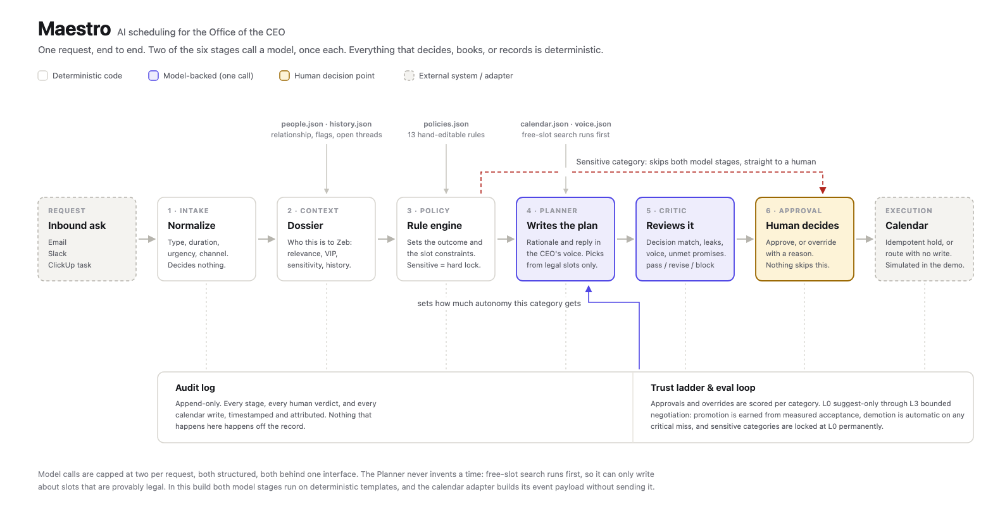

# Maestro

**An AI scheduling system for the Office of the CEO.** Built as a ClickUp Chief of Staff case
study: *design an AI system that automates scheduling for a CEO.*

Maestro turns one inbound request into a decision, a written justification, and a drafted reply,
then stops and waits for a human. Every decision ships with the context that produced it and the
policy rule that decided it. Autonomy is earned per category and revoked automatically on any
serious miss.

> **No decision without a dossier.**

**[Live demo](https://maestro-ceo-scheduling.vercel.app)** ·
**[Architecture diagram](static/architecture.png)** ·
**[Executive summary](EXECUTIVE-SUMMARY.md)**

---

## The problem

A CEO's calendar is a judgment problem, not a scheduling one. Every ask carries a question no
availability tool answers: does this person deserve this hour, this week, ahead of everyone else
who wants it? Answering it needs context that today lives in one chief of staff's head, which
makes them a bottleneck when busy and a single point of failure when they leave.

The reason this work has not been handed to software is trust, not capability. A founder who lives
in the details will not delegate their calendar to something that cannot show its work.

## The solution

Six stages, run in order, with an audit entry written at each one.



| # | Stage | Kind | What it does |
|---|-------|------|--------------|
| 1 | **Intake** | Deterministic | Normalizes the raw email, Slack message, or ClickUp task. Decides nothing. |
| 2 | **Context** | Deterministic | Builds the dossier: relationship, strategic relevance, VIP and sensitivity flags, open commitments. |
| 3 | **Policy** | Deterministic | Evaluates 13 hand-editable rules in priority order. Sets the outcome and the slot constraints. |
| 4 | **Planner** | **Model-backed** | Writes the decision rationale and the reply in the CEO's voice. One call. |
| 5 | **Critic** | **Model-backed** | Reviews the plan before a human sees it. Returns pass, revise, or block. One call. |
| 6 | **Approval** | Deterministic | Routes to a human. Nothing is sent or booked without one. |

Then the **calendar adapter** executes the approved plan, and the **trust ladder** scores the
human's verdict and adjusts how much autonomy that category gets next time.

## Model-backed versus deterministic

This is the load-bearing design decision, so it is worth stating plainly.

**Model-backed. Two stages, one call each:**

- **Planner** (`maestro/planner.py`) writes the rationale and the draft reply.
- **Critic** (`maestro/critic.py`) reviews that work.

**Deterministic. Everything else:**

request normalization (`intake.py`), context assembly (`context.py`), the policy engine
(`policy.py`), calendar math and free-slot search (`calendarlib.py`), approval routing
(`pipeline.py`), calendar execution (`execute.py`), the audit trail (`audit.py`), the trust ladder
(`trust.py`), the eval loop (`evals.py`), the daily brief (`brief.py`), and the calendar optimizer
(`optimizer.py`).

Three consequences follow, and they are the point:

1. **The policy engine sets the outcome, not the model.** A model cannot talk its way into a
   meeting the rules forbid.
2. **The Planner cannot invent a time.** `find_slots` runs *before* the model call and only ever
   returns slots that are provably free, inside business hours, and compliant with every
   constraint the fired rules attached. The Planner writes about that list; it does not produce it.
3. **Sensitive topics never reach a model stage at all.** The hard lock fires at the policy engine
   and routes straight to a human.

Both model stages go through one interface (`maestro/llm.py`) and return structured objects, the
same shape a real model returns under a JSON schema. The cap of two calls per request is declared
in one place, in `llm.TASKS`.

## What the Critic actually does

A reviewer stage is easy to add as decoration. This one is not. It runs four checks that
deterministic code genuinely cannot perform, because they are judgments about meaning:

| Check | Catches |
|-------|---------|
| `decision_match` | The reply does not do what the decision said. Offering times on a request that was declined; escalating with an outbound auto-reply. |
| `sensitive_handling` | A locked topic leaked into an external message, or a hard-locked request carries calendar holds. |
| `voice_compliance` | Corporate filler the voice guide rules out, a missing signoff, no concrete next step. |
| `commitment_coverage` | The reply ignores something the CEO already owes this person. |

Slot legality is deliberately *not* a check. Those slots are legal by construction, so re-verifying
them would be theater. The Critic reviews judgment, not arithmetic.

In the demo, the board member's request trips `commitment_coverage`: the reply never mentions the
churn cohort analysis promised on June 30 and still not sent. The verdict is the gate on autonomy:
as categories climb the ladder, only a clean `pass` is ever eligible to execute unattended.

## The trust ladder

| Level | Meaning | Promotion gate |
|-------|---------|----------------|
| L0 | Suggest only; a human executes everything | - |
| L1 | Drafts replies and holds; a human approves each | ≥95% acceptance over 2 weeks |
| L2 | Auto-handles low-stakes internal moves, logs all | ≥98% accuracy at L1, zero critical misses |
| L3 | Negotiates external scheduling within policy | Explicit human sign-off per category |

Demotion is **automatic** on any critical miss, meaning a human reversal on a VIP or a sensitive
category. Sensitive categories (board governance, legal, M&A, personnel) are hard-locked at L0
permanently and cannot be promoted by any track record.

## Run it

```bash
make install     # venv + dependencies
make run         # http://localhost:8000
make test        # 59 tests
make reset       # restore the seeded demo state
```

No database, no API keys, no network calls at runtime. All state is human-readable JSON in `data/`,
editable by hand before a run.

## Five-minute review path

1. **Request Pipeline** → click **Dana Whitfield**, hit **Run pipeline**. Watch all six stages. The
   board member is accepted inside 48 hours with times in her timezone, and the Critic flags the
   unmet commitment.
2. Click **Jordan Ellis**, run it. The sensitive-category lockout fires at the policy engine.
   Maestro builds the dossier and stops; no draft, no hold, no model call on the topic.
3. Click **Grace Okafor**, run it. Accepted with Sydney-fair mornings, and a clean Critic pass.
4. **Daily Brief** → read the brief, then **Approve** Dana's plan. The calendar adapter places the
   hold and says so.
5. **Override** Grace's plan instead, with any reason. She is a VIP, so the reversal is a critical
   miss and demotes external partners L1 → L0 live.
6. **Trust & Audit** → the demotion is already on the ladder, the metrics moved, and the audit log
   shows every step you just took, including the calendar write.

**Reset demo** in the header restores the seeded state at any point.

## Key design decisions

1. **Two model calls, not an agent swarm.** Naming every module an "agent" would inflate the
   architecture without adding capability. Six stages, two of which call a model, is the honest
   description and the more defensible system.
2. **Policy as data, not code.** `data/policies.json` holds 13 rules, each with a plain-English
   statement of intent. A chief of staff can read, argue with, and edit it without an engineer.
3. **Board scheduling and board sensitivity are different things.** "Board members get time within
   48 hours" and "board topics are sensitive" only conflict if read loosely. Routine board
   *scheduling* proceeds under the 48-hour rule; the board *category* is trust-locked at L0; board
   *governance topics* trigger the hard lock. A sharp chief of staff books the board member fast
   and still never lets software decide governance matters.
4. **Intake must never decide.** The recruiter's request classifies as `external_partner` from its
   text alone. The *dossier* carries the `personnel` flag, and the lock fires on the dossier. That
   is the whole argument for a separate context stage.
5. **Escalations produce an internal routing note, never an outbound reply.** Auto-replying to a
   journalist or a confidential personnel matter is itself a judgment call the system should not
   make.
6. **Protected blocks are never offered proactively**, to anyone. The board and legal exemption
   governs *displacement* of a block, not whether it shows up in a list of free times.
7. **Timezone fairness is a policy constraint, not a formatting choice.** Proposed times must land
   in the requester's working day, and every draft shows their local time first.
8. **Execution is idempotent by contract.** Each approval carries a stable idempotency key, so a
   replayed approval cannot double-book. That contract is real code today even though the send is
   simulated.
9. **Demo "now" is pinned** in `data/calendar.json` (`demo_now`) so slot math is deterministic and
   hand-tunable, and the eval window anchors to the newest recorded verdict rather than the wall
   clock.

## Known limitations, and what is simulated

Stated plainly, because the interface says the same thing.

- **The two model calls are simulated.** They run on deterministic templates behind the
  `ModelProvider` interface. The call sites, the structured contracts, and the Critic's four checks
  are real; only the network round trip is absent. Production registers a Claude-backed provider
  and changes no pipeline code. This was a deliberate choice: it keeps the live demo unfailable and
  keeps output stable across runs.
- **The calendar adapter is simulated.** `execute.py` builds the exact event payload and
  idempotency key it would send and records it, but makes no external call. Implementing `_send`
  against a real client is the only change needed.
- **All data is fictional.** Six requests, six people, one week of calendar, and a seeded two-week
  history of human verdicts that produces the trust metrics you see.
- **On the deployed demo, state lives in memory.** The serverless filesystem is read-only, so a run
  is fully real and interactive but resets on a cold start or when you press Reset demo. Locally it
  persists to the JSON files in `data/`.
- **Intake classification is keyword-based.** Deliberate: it is the stage that must never decide,
  and a cheap deterministic classifier that hands off to a dossier is the right amount of machinery
  there.
- **Not built:** multi-party negotiation across external calendars, recurring-meeting policy,
  travel and timezone drift for the CEO, and real channel adapters for Gmail, Slack, and ClickUp.

## Repo layout

```
app.py                  FastAPI server and API
api/index.py            Vercel entry point (same ASGI app)
maestro/
  pipeline.py           the six-stage orchestrator
  intake.py             1 · normalize          (deterministic)
  context.py            2 · dossier            (deterministic)
  policy.py             3 · rule engine        (deterministic)
  planner.py            4 · plan               (model-backed)
  critic.py             5 · review             (model-backed)
  execute.py            calendar adapter       (deterministic, simulated send)
  llm.py                the model seam, and the two-call cap
  calendarlib.py        free-slot search and timezone math
  trust.py  evals.py    the trust ladder and its measurement half
  audit.py  store.py    append-only log, in-memory JSON state
  brief.py  optimizer.py  daily brief, background calendar pass
data/                   all state as hand-editable JSON, plus seed/ snapshots
static/                 single-page UI, no build step, no dependencies
tests/                  59 tests: policy, trust, pipeline, critic, execution
```
